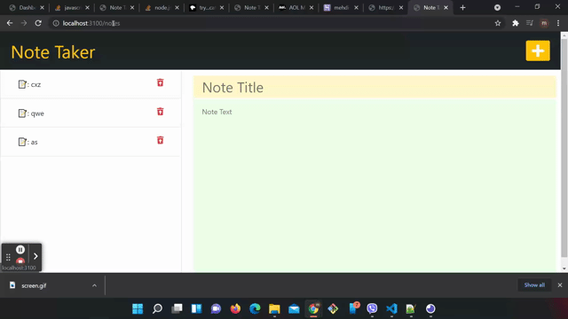

[](https://opensource.org/licenses/MIT)

# Express.js: Note Taker

# Table of Contents 

* [Description](#description)
* [Mock-Up](#🚀)
* [Installation](#installation)
* [Getting Started](#📚)
* [Websites](#websites)


## 📝
## Description 
A note taker application that can be used to write and save notes. This application will use an Express.js back end and will save and retrieve note data from a JSON file.

The application consists ofthe front end and the back end, connect the two, and then deploy the entire application to Heroku.


## 🚀
## Mock-Up

The following images show the web application's appearance and functionality:




## 🛠️ 
##  Installation
```bash
npm i
```

### this will install the following dependencies 
```bash
 "dependencies": {
    "express": "^4.17.1",
    "moment": "^2.29.1",
    "util": "^0.12.4"
  }

```

# 📚
## Getting Started

On the back end, the application  include a `db.json` file that will be used to store and retrieve notes using the `fs` module.

The following HTML routes are  created:

* `GET /notes` will  return the `notes.html` file.

* `GET *` will return the `index.html` file.

The following API routes should be created:

* `GET /api/notes` will read the `db.json` file and return all saved notes as JSON.

* `POST /api/notes` will receive a new note to save on the request body, add it to the `db.json` file, and then return the new note to the client.

* `GET /api/notes/:id` get the notes by id because each note has a unique id.  

* `DELETE /api/notes/:id` will receive a a request  to delete a nothe with the givin id from the `db.json` file, and then update the notes.html page


## Websites
* Github: https://github.com/MehdiMahmud79/Note-Taker

* 🌐 Live: https://mehdimahmud79.github.io/Note-Taker/

* ⚛️ Heroku: https://mehdi-note-taker.herokuapp.com/

---
© 2021 Mehdi Mahmud
